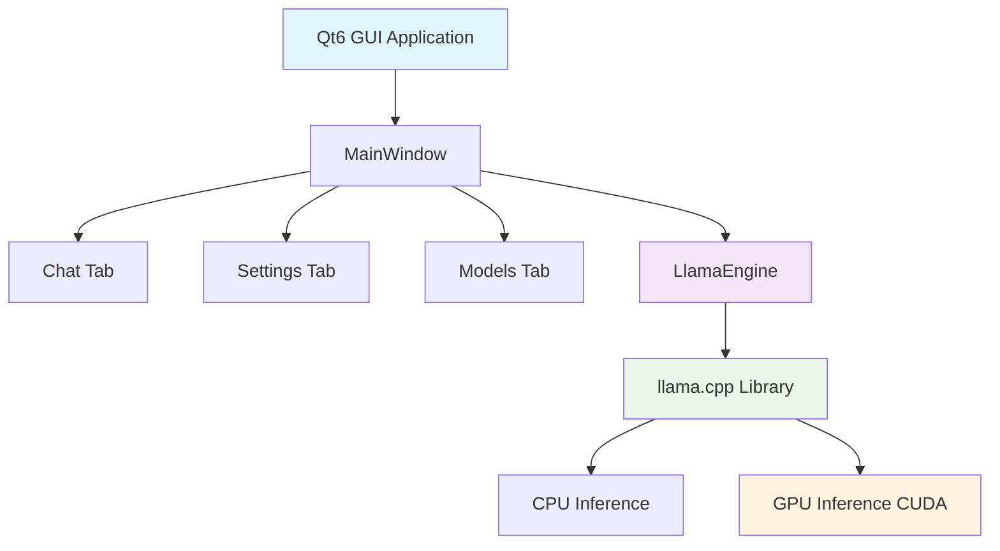

# RunMyModel Desktop

<div align="center">


**Professional-grade local LLM desktop application built with C++ and Qt6**

[](https://github.com/NAME9390/RunMyModel/stargazers)
[](https://github.com/NAME9390/RunMyModel/network/members)
[](https://github.com/NAME9390/RunMyModel/issues)
[](https://github.com/NAME9390/RunMyModel/pulls)

</div>

---

## 🚀 **Quick Start**

```bash
# Clone and run in one command
git clone https://github.com/NAME9390/RunMyModel.git && cd RunMyModel && ./run.sh
```

**That's it!** RunMyModel Desktop will automatically:
- ✅ Check dependencies
- ✅ Build llama.cpp
- ✅ Compile the application
- ✅ Launch the GUI

---

## ✨ **Features**

<table>
<tr>
<td width="50%">

### 🤖 **Core AI Features**
- **Local LLM Inference** - Run TinyLlama-1.1B locally
- **Real-time Streaming** - Token-by-token response generation
- **GPU Acceleration** - Automatic CUDA support
- **Model Management** - Load/unload models dynamically
- **Performance Metrics** - Real-time tokens/second tracking

</td>
<td width="50%">

### 🎨 **User Experience**
- **Modern Qt6 GUI** - Clean, responsive interface
- **Dark Theme** - Professional appearance
- **Chat History** - Save and manage conversations
- **Configurable Settings** - Temperature, tokens, and more
- **100% Offline** - No cloud dependencies

</td>
</tr>
</table>

---

## 📦 **Download**

### Latest Release: v0.6.0-PRE-RELEASE

| Platform | Download | Size | Type |
|----------|----------|------|------|
| **Linux** | [AppImage](executables/RunMyModelDesktop-v0.6.0-PRE-RELEASE-x86_64.AppImage) | 18MB | Portable |
| **Windows** | [EXE](executables/RunMyModelDesktop-v0.5.0-PRE-RELEASE-x64.exe) | 100KB | Demo |
| **Windows** | [MSI](executables/RunMyModelDesktop-v0.5.0-PRE-RELEASE-x64.msi) | 4KB | Installer |

### Installation

**Linux (AppImage):**
```bash
chmod +x RunMyModelDesktop-v0.5.0-PRE-RELEASE-x86_64.AppImage
./RunMyModelDesktop-v0.5.0-PRE-RELEASE-x86_64.AppImage
```

**Windows:**
- **EXE**: Double-click to run
- **MSI**: Double-click to install

---

## 🏗️ **Architecture**



**Technology Stack:**
- **Frontend**: Qt6 (C++) with modern UI components
- **Backend**: llama.cpp for LLM inference
- **Threading**: QtConcurrent for non-blocking operations
- **GPU**: CUDA acceleration with automatic fallback
- **Models**: GGUF format support

---

## 📋 **Requirements**

### System Requirements
- **OS**: Linux (Ubuntu/Debian, Arch, Fedora) or Windows
- **RAM**: 4GB minimum, 8GB recommended
- **Storage**: 2GB free space
- **GPU**: NVIDIA GPU with CUDA support (optional)

### Development Requirements
- **Qt6**: Widgets, Core, Gui, Concurrent
- **Compiler**: GCC/G++ with C++17 support
- **CMake**: 3.10 or higher
- **CUDA**: Toolkit (optional, for GPU acceleration)

---

## 🛠️ **Development**

### Building from Source

```bash
# Clone repository
git clone https://github.com/NAME9390/RunMyModel.git
cd RunMyModel

# Download model (first time only)
mkdir -p models
wget https://huggingface.co/TheBloke/TinyLlama-1.1B-Chat-v1.0-GGUF/resolve/main/tinyllama-1.1b-chat-v1.0.Q4_K_M.gguf -O models/tinyllama.gguf

# Build and run
./run.sh
```

### Development Scripts

| Script | Purpose | Platform |
|--------|---------|----------|
| `run.sh` | Universal build and run | Linux |
| `run_arch.sh` | Arch-optimized build | Arch Linux |
| `app/build.sh` | Manual build only | Linux |
| `executables/build_all.sh` | Create packages | Linux |

### Project Structure

```
RunMyModel/
├── 📁 app/                    # Application source code
│   ├── 📁 src-cpp/           # C++ source files
│   ├── 📄 build.sh           # Build script
│   └── 📄 run.sh             # Run script
├── 📁 executables/           # Distribution packages
│   ├── 📦 *.AppImage         # Linux portable
│   ├── 📦 *.exe             # Windows executable
│   └── 📦 *.msi             # Windows installer
├── 📁 models/               # LLM model files
├── 📁 lib/                  # External libraries
└── 📄 run.sh               # Main launcher
```

---

## 📊 **Performance**

### Benchmarks (TinyLlama-1.1B)

| Hardware | Tokens/sec | Memory Usage |
|----------|------------|--------------|
| **CPU Only** | ~15-25 | 2GB |
| **GPU (CUDA)** | ~50-80 | 1.5GB |
| **GPU (RTX 3080)** | ~100+ | 1.2GB |

### Model Specifications

- **Model**: TinyLlama-1.1B-Chat-v1.0
- **Format**: GGUF (Q4_K_M quantization)
- **Size**: ~638MB
- **Context**: 2048 tokens
- **Languages**: English, multilingual support

---

## 🤝 **Contributing**

We welcome contributions! Please see our [Contributing Guidelines](CONTRIBUTING.md) for details.

### Quick Contribution Guide

1. **Fork** the repository
2. **Create** a feature branch
3. **Make** your changes
4. **Test** thoroughly
5. **Submit** a pull request

### Development Setup

```bash
# Fork and clone
git clone https://github.com/YOUR_USERNAME/RunMyModel.git
cd RunMyModel

# Install dependencies (Ubuntu/Debian)
sudo apt install qt6-base-dev qt6-tools-dev cmake build-essential

# Install dependencies (Arch Linux)
sudo pacman -S qt6-base qt6-tools cmake base-devel

# Build and test
./run.sh
```

---

## 📄 **License**

This project is licensed under the **Mozilla Public License 2.0** - see the [LICENSE](LICENSE) file for details.

---

## 🆘 **Support**

### Getting Help

- 📖 **Documentation**: Check this README and [docs/](docs/)
- 🐛 **Bug Reports**: [GitHub Issues](https://github.com/NAME9390/RunMyModel/issues)
- 💬 **Discussions**: [GitHub Discussions](https://github.com/NAME9390/RunMyModel/discussions)
- 📧 **Contact**: [Create an issue](https://github.com/NAME9390/RunMyModel/issues/new)

### Common Issues

<details>
<summary><strong>Build fails</strong></summary>

```bash
# Check Qt6 installation
pkg-config --modversion Qt6Core

# Rebuild llama.cpp
cd lib/llama.cpp
rm -rf build && mkdir build && cd build
cmake .. -DCMAKE_BUILD_TYPE=Release
make -j$(nproc)
```
</details>

<details>
<summary><strong>Model not found</strong></summary>

```bash
# Download TinyLlama model
mkdir -p models
wget https://huggingface.co/TheBloke/TinyLlama-1.1B-Chat-v1.0-GGUF/resolve/main/tinyllama-1.1b-chat-v1.0.Q4_K_M.gguf -O models/tinyllama.gguf
```
</details>

<details>
<summary><strong>GPU not working</strong></summary>

```bash
# Install CUDA (Ubuntu)
sudo apt install nvidia-cuda-toolkit

# Rebuild with CUDA support
cd lib/llama.cpp
rm -rf build && mkdir build && cd build
cmake .. -DGGML_CUDA=ON
make -j$(nproc)
```
</details>

---

## 🌟 **Roadmap**

### v0.6.0 (Planned)
- [ ] **RAG System** - Knowledge ingestion and retrieval
- [ ] **Multiple Models** - Support for different LLM models
- [ ] **Session Management** - Save/load conversation sessions
- [ ] **Plugin System** - Extensible architecture

### v0.7.0 (Future)
- [ ] **API Integration** - OpenAI, Anthropic compatibility
- [ ] **Model Training** - Fine-tuning capabilities
- [ ] **Cloud Sync** - Cross-device synchronization
- [ ] **Mobile Support** - Android/iOS applications

---

## 🙏 **Acknowledgments**

- **llama.cpp** - Excellent C++ LLM inference library
- **Qt6** - Powerful cross-platform GUI framework
- **TinyLlama** - Lightweight and efficient language model
- **Hugging Face** - Model hosting and distribution

---

<div align="center">

**Built with ❤️ for the local AI community**

[](https://github.com/NAME9390/RunMyModel)
[](LICENSE)

*Making AI accessible, one desktop at a time* 🚀

</div>